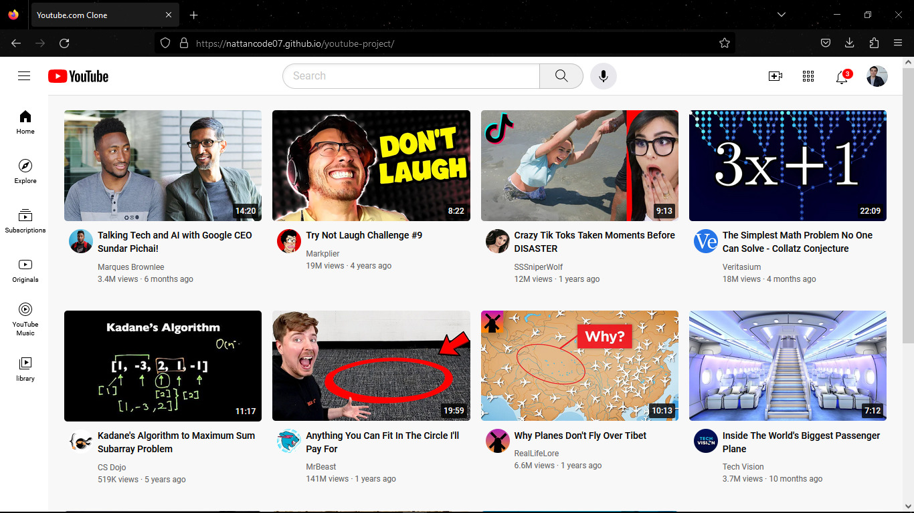

<h1> 

  

Youtube Clone

</h1>

## 🚨 Sobre

**Youtube Clone** é um projeto que desenvolvi ao participar de um bootcamp gratuito no youtube do canal supersimpledev. Nele aprendi e relembrei coiceitos importantes de HTML e CSS, como Flexbox, Grid e Positions.
   

## 🔧 Ferramentas

- HTML
- CSS (FlexBox, Grid, Responsividade e etc.)

 

## 🎯 Link do projeto:
### <a target="_blank" href="https://nattancode07.github.io/youtube-project/">https://nattancode07.github.io/youtube-project/</a>